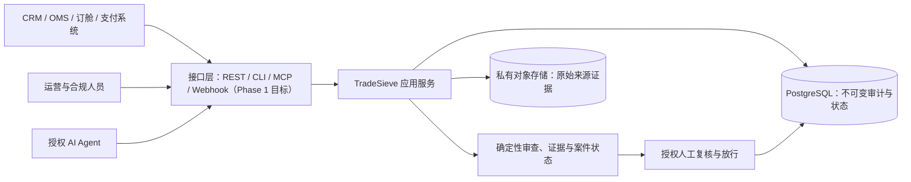

# TradeSieve

> 面向制裁、出口管制与敏感交易审查的独立合规决策支持服务。

[](#项目进度)
[](docs/getting-started/docker-reference.md)
[](docs/decisions/0002-human-clearance-only.md)
[](docs/architecture/agent-interface-principles.md)

TradeSieve 的目标是在 CRM、订单、订舱、运输和支付系统旁边建立一道独立、可审计、可替换的合规控制边界。业务系统仍然是业务数据的主系统；TradeSieve 负责接收一次待审查动作，固定输入和证据版本，执行确定性规则，保存审查轨迹，并在不确定、资料缺失或命中风险时给出 `HOLD` / 人工复核要求。

项目起源于一个真实问题：国际物流企业因俄罗斯相关业务受到连带制裁影响，需要把受制裁主体、受限国家/地区、两用物项、敏感货物、路线和交易风险的审核能力，从零散人工查询升级为可嵌入业务流程的独立服务，同时保持与现有 CRM/OMS 解耦，并为传统 API、CLI 和 AI Agent/MCP 保留同一套契约。

> TradeSieve 是决策支持和证据编排工具，不是法律意见，也不会自动宣布一笔交易“合法”“无制裁风险”或“可以放行”。最终放行必须由获得授权的人作出。

## 它准备解决什么问题

- 在客户准入、询报价、下单、订舱、出运和付款前形成统一审查入口；
- 对交易方、所有权与控制、货物、路线、最终用途、支付和单证进行结构化检查；
- 保存所用数据源、规则、输入、模型和人工决定的精确版本，支持重放与审计；
- 将“确定命中”“可能命中”“资料不足”“服务不可用”明确区分，默认失败关闭；
- 让 CRM/OMS 通过 REST/事件接入，让运营人员通过 CLI 使用，让授权 Agent 通过 MCP 使用；
- 将外部制裁数据、规则引擎和业务系统隔离开，避免把供应商或单一模型锁进核心流程。

## 系统边界



接口层不会拥有另一套业务规则。领域模型和应用契约是唯一事实来源，REST/OpenAPI、JSON Schema、CLI、MCP 和事件适配器共享它们。

## 项目进度

**当前阶段：Phase 1 MVP 开发中。现在已有可运行的合成受理与基础设施演示，但还没有可供外部系统提交真实 screening 请求的公开接口。**

截至 2026-08-10，进度如下：

| 能力 | 状态 | 当前结果 |
| --- | --- | --- |
| 工程基础与 CI | ✅ 已完成 | 锁定 Python/依赖、架构边界、构建、文档、契约、秘密和依赖审计门禁 |
| Docker 参考部署 | ✅ 已完成 | 非 root、只读容器；PostgreSQL 18.4；app/worker；内部网络；持久卷 |
| 身份、租户与授权 | ✅ 已完成 | deny-by-default、对象级授权、不可变授权审计 |
| 数据源注册与就绪度 | ✅ 已完成 | 版本化来源清单、时效检查、fail-closed readiness |
| 规则包治理 | ✅ 已完成 | 有版本、有引用、可审批/激活/回滚的合成规则包 |
| 原始来源快照 | ✅ 已完成 | 私有不可变对象、解析/验证证据、双人治理、PostgreSQL 持久化 |
| 规范化受理与幂等 | ✅ 合成演示可用 | 严格 canonical intake、授权范围幂等、原子审计/outbox、PostgreSQL 18.4 持久化和 demo-only 运行入口；见 [TS-302](https://github.com/fyaic/TradeSieve/issues/21) / [PR #36](https://github.com/fyaic/TradeSieve/pull/36) |
| 合成物流 CRM 门禁 | ✅ demo-only 可用 | 5 条中国货代风格合成询报价，演示红灯升级、黄灯补件/拦截和绿灯候选的人工确认边界；见 [使用指南](docs/getting-started/demo-crm.md) / [TS-505](https://github.com/fyaic/TradeSieve/issues/37) |
| 确定性审查与证据 | ⏳ 下一步 | 受治理规则、来源快照和物化事实的确定性评估 |
| 案件/发现项/处置状态 | ⏳ 计划中 | 结构化 finding、evidence、hold 和人工决定 |
| Screening REST API | ⏳ 计划中 | CRM/OMS 同步拦截与查询；当前 OpenAPI 仍是设计契约，不是已上线接口 |
| Screening CLI 与 MCP | ⏳ 计划中 | 面向运营/CI 和 Agent 的同契约适配器；当前尚无 MCP Server |
| Webhook 与可观测性 | ⏳ 计划中 | 签名事件、脱敏日志/指标/链路 |

当前开发分支最近一次完整门禁为 **1,734 个测试通过，10,021 条语句和 2,806 个分支 100% 覆盖**；独立 PostgreSQL 18.4 门禁也已完成迁移、真实事务、双连接竞态、约束、破坏/修复、降级再升级和零残留验证。这些证据证明当前代码边界和回归集，不代表制裁数据覆盖率、法律正确率或生产可用性。

详细范围见 [MVP 定义](docs/product/mvp-scope.md)、[Phase 1 计划](docs/delivery/phase-1-plan.md) 和 [敏捷 backlog](docs/delivery/phase-1-backlog.md)。

## 现在可以怎样使用

目前对外可用的是一个**合成数据、demo-only 的受理生命周期、运维检查面和物流 CRM 演示页**。它可以验证部署、数据库迁移、数据源/规则/快照治理、幂等受理、持久化和失败关闭行为，并用预置合成 finding/result 展示 CRM 拦截效果；不能提交真实客户或交易，CRM 演示也不是实时审查引擎。

### 1. 启动参考环境

前提：Docker Desktop 或兼容的 Docker Engine/Compose，以及本私有仓库的访问权限。

```bash
git clone git@github.com:fyaic/TradeSieve.git
cd TradeSieve
cp .env.example .env
docker compose up -d --build --wait
docker compose ps
```

确认进程存活与业务依赖就绪：

```bash
curl --fail http://127.0.0.1:8080/health/live
curl --fail http://127.0.0.1:8080/health/ready
```

`/health/live` 只表示 HTTP 进程可响应；`/health/ready` 还会核验数据库迁移、来源清单、私有快照证据和已激活规则包。HTTP `200` 仅表示服务具备运行条件，绝不表示任何交易已获放行。

### 2. 打开合成物流 CRM 演示

参考栈就绪后，在浏览器打开：

```text
http://127.0.0.1:8080/demo/crm
```

选择一条固定合成询报价并点击“发起合规审查”。页面会展示：

- 上海到莫斯科工业控制设备的合成主体强标识符命中和红灯升级；
- 锂电池运输文件、最终用户、转售路径或敏感参数不足时的黄灯补件/拦截；
- 没有开放 P0/P1 时的绿灯候选，以及仍需授权人工确认的非放行边界；
- CRM 到 TradeSieve 的字段映射、输入指纹、`screening_id`、`case_id` 和结果指纹。

页面和接口只在 demo 模式注册，全部名称、登记号、金额、路线和单证均为固定合成 fixture。它使用真实规范输入校验与规范结果模型，但 finding 和处置结果是预置演示数据，不是实时名单或法律规则执行。完整说明见 [合成 CRM 使用指南](docs/getting-started/demo-crm.md)。

### 3. 使用当前运维 CLI

```bash
# 总体就绪度与有限检查项
docker compose run --rm --no-deps app \
  python -m tradesieve.manage inspect

# 数据源注册表的安全投影
docker compose run --rm --no-deps app \
  python -m tradesieve.manage list-sources

# 已验证来源快照的安全元数据投影
docker compose run --rm --no-deps app \
  python -m tradesieve.manage list-source-snapshots

# 当前激活的合成规则包
docker compose run --rm --no-deps app \
  python -m tradesieve.manage list-rules
```

这些命令只返回经过裁剪的运维安全字段，不导出原始来源字节、客户数据、凭据或私有规则文本。

### 4. 演示一次可重放的合成受理

以下入口只使用仓库内置合成交易，不读取文件、标准输入或真实业务数据。先提交一个固定合成请求：

```bash
docker compose run --rm --no-deps app \
  tradesieve-manage submit-demo-screening \
  --idempotency-key synthetic-order-001 \
  --fixture baseline
```

首次返回 `APPLIED` 和一组稳定的 opaque intake/screening/outbox ID；原命令重试返回 `REPLAY`，且收据引用保持不变。用同一个 key 提交语义变化的合成版本，可观察失败关闭的幂等冲突（退出码 `4`）：

```bash
docker compose run --rm --no-deps app \
  tradesieve-manage submit-demo-screening \
  --idempotency-key synthetic-order-001 \
  --fixture changed
```

这是用于架构评估、CI 和接入方理解受理语义的 operations demo，不是接收任意输入的正式 screening CLI。它只证明“请求被安全、可审计地受理”，不代表已经执行制裁/两用物项判断，更不代表可以放行。

### 5. 停止并清理 demo

```bash
docker compose down --volumes --remove-orphans
```

该命令会删除 demo PostgreSQL 和原始对象命名卷。不要把试点或生产证据放入这套参考栈。

## 外部用户和系统如何接入

### 今天

| 使用者 | 现在可做什么 | 现在不能做什么 |
| --- | --- | --- |
| 架构/安全评估者 | 启动 Compose；检查健康、治理、幂等受理、重放/冲突、CRM 门禁和失败关闭行为 | 不能提交真实客户、货物或交易 |
| 开发者 | 运行完整测试与合成收据生命周期；审查领域模型、OpenAPI/JSON Schema、CRM demo adapter 和合成示例 | 不应把 demo 命令、demo API 或草案 OpenAPI 当作正式在线 API |
| CRM/OMS 团队 | 在浏览器观察字段映射、红黄绿候选状态、补件和外部引用；用合成命令验证幂等语义；依据 [集成设计](docs/architecture/integration-design.md) 准备拦截点 | 尚不能向正式 screening endpoint 提交任意业务请求或接收 webhook |
| AI/Agent 团队 | 审查 [Agent 接口原则](docs/architecture/agent-interface-principles.md) 和共享 Schema | 尚不能连接 MCP Server |
| 合规人员 | 审查产品范围、证据模型、规则治理和人工放行边界 | 尚没有完整案件复核工作台 |

当前正式 HTTP 操作清单只实现：

```text
GET /health/live
GET /health/ready
```

demo 模式另注册隐藏于 OpenAPI 的 `/demo/crm` 及固定 fixture API。它们不接收任意交易输入，也不会在 production 模式存在。

仓库中的 [OpenAPI](api/openapi/tradesieve.v1.json)、[JSON Schema](api/schemas/tradesieve.contracts.v1.json) 和 `examples/` 是用于设计、评审和生成测试的版本化契约，尚不等于已实现的路由。

### Phase 1 完成后的目标用法

CRM/OMS 的目标接入流程是：

1. 在客户准入、报价、下单或订舱前构造 canonical request；
2. 使用已验证的服务身份、`Idempotency-Key` 和 correlation ID 调用 REST；
3. 将返回的 `HOLD` / `REVIEW_REQUIRED` 作为真正的业务拦截，不把网络或依赖失败解释为通过；
4. 保存 TradeSieve 的 opaque screening/case ID，不复制其内部审计状态；
5. 通过签名 webhook 或查询接口接收复核、过期和重筛结果。

CLI 和 MCP 将调用相同的应用服务和契约：CLI 面向运营、CI 与批量诊断；MCP 面向获得授权的 Agent，工具将返回结构化证据并保留人工确认门，不提供绕过授权或直接“自动放行”的能力。

目标体验见 [MVP 用户旅程](docs/getting-started/mvp-user-experience.md)。在对应实现和发布门禁通过前，其中的 screening 命令和接口均视为设计目标。

## 本地开发与验证

项目使用 CPython 3.13.14 和 `uv` 0.12.1。非容器门禁：

```bash
./scripts/check.sh
```

它会执行锁文件检查、格式化检查、Ruff、strict mypy、单元/架构测试与 100% 覆盖率、构建、文档/OpenAPI 校验、秘密扫描和依赖审计。

额外的真实运行证据：

```bash
./scripts/test_source_snapshot_postgres.sh  # PostgreSQL 18.4 持久化/并发/约束
./scripts/test_screening_submission_postgres.sh  # 受理幂等/事务/竞态/破坏修复
./scripts/test_compose.sh                   # 完整参考部署与零残留验收
```

详见 [开发环境](docs/getting-started/development.md) 和 [Docker 参考部署](docs/getting-started/docker-reference.md)。测试与示例只能使用合成数据，禁止提交客户、货运、支付、身份、凭据或生产证据。

## 仓库结构

| 路径 | 用途 |
| --- | --- |
| `docs/requirements/` | 原始需求、问题和范围 |
| `docs/product/` | 服务定义、角色旅程、详细需求和 MVP 边界 |
| `docs/architecture/` | 服务、领域、集成、安全和实现设计 |
| `docs/decisions/` | 架构决策记录 |
| `docs/delivery/` | 敏捷开发方式、Phase 1 计划和 backlog |
| `docs/research/` | 法规数据源、开源、学术和工业界调研 |
| `api/openapi/` | 生成的版本化 HTTP 设计契约 |
| `api/schemas/` | 所有适配器共享的 JSON Schema 注册表 |
| `examples/` | 合成请求、响应和事件 |
| `research/sources.yaml` | 机器可读的调研来源注册表 |
| `src/tradesieve/` | Python 领域、应用、端口和适配器实现 |
| `tests/` | 单元、契约和架构边界测试 |
| `compose.yaml`, `Dockerfile` | demo-only 参考运行环境 |
| `scripts/` | 仓库、数据库、Compose 和契约门禁 |

完整入口见 [文档索引](docs/README.md)。

## 核心原则

- **业务系统与合规控制解耦：** TradeSieve 不接管 CRM/OMS 的主数据职责。
- **证据优先于分数：** 结果必须说明来源、规则、事实、不确定性和下一步动作。
- **自动化只能收紧：** 自动化可以阻断或升级，不能自行作出最终法律放行。
- **一次建模，多种接口：** REST、CLI、MCP 和事件共享领域模型，避免接口漂移。
- **可重放、可追溯：** 原始来源、解析结果、规则、输入和决定都按版本留痕。
- **私有和最小披露：** 生产数据默认不离开批准的部署边界；公开/运维投影只返回必要字段。
- **AI 是助手，不是裁决者：** AI 可用于提取、归一化、比较和草拟，确定性控制与人工复核拥有处置权。

## 明确不做的事

- 仅凭国家、HS 编码或模糊名称匹配就宣布交易可以放行；
- 替代海关归类、出口管制律师、监管机构、银行或商业数据供应商；
- 默认把生产客户或交易数据发送给第三方 AI 服务；
- 无来源、无版本、无审批地抓取并覆盖制裁或出口管制规则；
- 在 Phase 1 宣称全球法规、历史或名单覆盖完整。

## 治理

本项目位于私有 `fyaic` GitHub 组织，采用敏捷增量、独立审查和证据门禁。参见 [CONTRIBUTING.md](CONTRIBUTING.md)、[SECURITY.md](SECURITY.md)、[GOVERNANCE.md](GOVERNANCE.md) 与 [敏捷开发方式](docs/delivery/agile-operating-model.md)。
