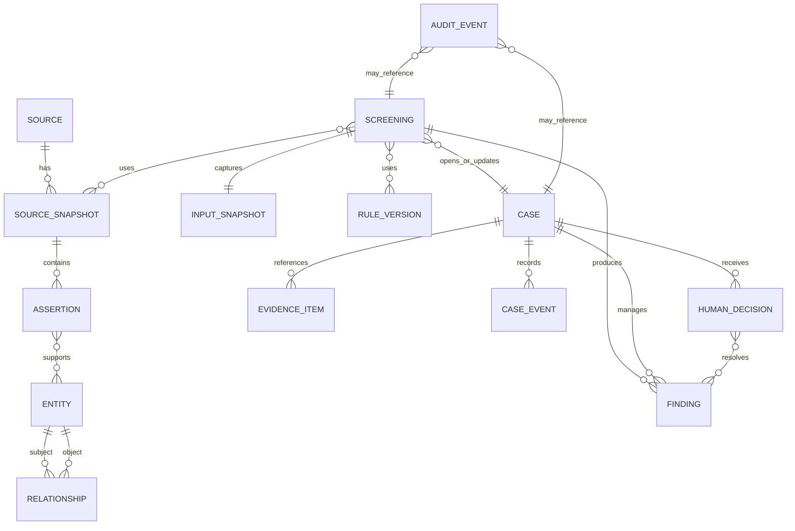

# Domain and data model

**Status:** Conceptual model for Phase 1 contract and persistence design.

## Modelling rules

1. Preserve source-native values; normalization creates linked assertions rather than overwriting facts.
2. Distinguish `unknown`, `not_provided`, `not_applicable`, and an explicit negative.
3. Store provenance and validity on assertions/relationships, not only on whole entities.
4. Store material changes as events; case state is a projection of those events plus open findings.
5. Separate business identifiers from internal opaque IDs and from evidence storage locations.
6. Model a proposed business **action**, not an abstract customer risk score.

## Core aggregates

| Aggregate | Purpose | Identity/invariant |
| --- | --- | --- |
| `Source` | Governance metadata and runtime freshness policy for an external/internal source | Stable deployment/source-set/source ID; incomplete records remain inactive |
| `SourceSnapshot` | Immutable retrieved/accepted source version | Hash, retrieval/effective time, parser version, activation event |
| `RuleBundle` | Immutable governed set of cited, fixture-backed rule versions | Tenant/deployment/rule-set namespace plus bundle/version/content hash; lifecycle events select the active version |
| `Assertion` | Source-native and normalized fact with locator | Cannot exist without provenance/snapshot |
| `Entity` | Canonical person/organization/vessel/etc. candidate | Merges are versioned assertions, never destructive source edits |
| `Relationship` | Ownership/control/directorship/agency/etc. | Subject/object/type/provenance/validity/reviewer state |
| `Screening` | Immutable request/version/result envelope | Canonical input hash plus explicit version set |
| `Case` | Human workflow around findings and a business action | State derived from open findings and human events |
| `Finding` | Structured issue and required action | Immutable initial record; status changes append events |
| `EvidenceItem` | Controlled reference/hash/metadata for evidence | Blob/path hidden from unauthorized clients |
| `HumanDecision` | Scoped authorized clearance, block, or no-action disposition | Actor, role, rationale, versions and scope required; clearance also requires expiry |
| `AuditEvent` | Append-only material action record | Globally unique ID, actor, time, object, action, hash/context |

## Relationship view



## Screening input

`ScreeningRequest` identifies:

- tenant/caller correlation and external business object;
- proposed action and enforcement due point;
- legal nexus known/unknown plus policy context;
- parties with explicit roles and identifiers;
- known ownership/control evidence;
- goods lines and technical/data completeness;
- route, end user/use, carrier/vessel, and payment chain;
- document/evidence references, not uncontrolled local paths;
- requested version policy (`current accepted` in Phase 1; explicit replay later).

The canonical request is normalized for hashing without changing meaningful array order/role semantics. The stored input snapshot retains the submitted representation and schema version.

## Finding structure

Each finding includes:

```json
{
  "finding_id": "fnd_...",
  "kind": "PARTY_CANDIDATE_MATCH",
  "priority": "P1",
  "status": "OPEN",
  "fact_class": "INFERENCE",
  "summary": "Candidate record requires human resolution",
  "evidence_refs": ["ev_..."],
  "source_refs": ["snapshot:record:field"],
  "rule_evaluation_refs": ["rule_version:evaluation"],
  "uncertainty": [
    {
      "fact_path": "parties.party-1.identifiers",
      "description": "Registration identifier missing"
    }
  ],
  "required_evidence_refs": ["req_registration_id"],
  "required_action": "OBTAIN_REGISTRATION_ID_AND_REVIEW",
  "owner_role": "COMPLIANCE_REVIEWER",
  "due_before": "QUOTE_RELEASE"
}
```

`fact_class` values are `VERIFIED_FACT`, `SOURCE_ASSERTION`, `INFERENCE`, or `UNKNOWN`. A reviewer resolution is a separate event and cannot rewrite the original class/evidence.

## Time model

At minimum, preserve:

- `source_effective_from/to`: when the source/legal assertion says it applies;
- `observed_at`: when TradeSieve retrieved/observed it;
- `recorded_at`: when the system committed it;
- `decision_effective_from/expires_at`: the human decision window;
- `business_action_due_at`: when the calling workflow needs an answer.

This supports current replay and prepares for bitemporal/as-of reasoning without pretending Phase 1 has complete historical coverage.

The implemented TS-201 registry keeps governance separate from the latest runtime
observation and derives freshness at query time. See the
[runtime source registry](source-registry.md) for activation, required-set, status,
redaction, and TS-202 snapshot-boundary semantics.

The implemented TS-205 rule-bundle aggregate keeps private immutable content,
append-only lifecycle events, authorization decisions, and command audits separate.
See [versioned rule bundles](rule-bundles.md) for governance, readiness, safe
projection, and the TS-202/TS-303 boundaries.

## Case event examples

- `case.opened`
- `finding.created`
- `evidence.requested`
- `evidence.submitted`
- `finding.resolved`
- `human_review.requested`
- `human_decision.recorded`
- `business_hold.placed`
- `business_hold.release_eligible`
- `decision.invalidated`
- `case.rescreened`
- `case.state_changed`

Events are immutable. A current-case table/projection may be updated transactionally for efficient reads, but the event/audit history remains the reconstruction record.

## Multi-tenancy decision

Phase 1 is **single deployment, tenant-aware schema**:

- every business/case record carries `tenant_id`;
- authorization always evaluates tenant and object scope;
- demo contains one tenant;
- PostgreSQL row-level security is defense in depth, not the only authorization layer;
- cross-tenant administration/export is not part of the MVP.

This avoids a future incompatible schema while keeping Phase 1 operations simple.
