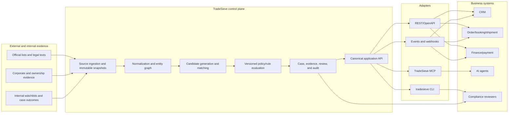

# Initial system shape

**Status:** Working hypothesis, not an implementation commitment.

## Boundary

TradeSieve should be a separately deployed control plane. CRM, OMS, booking, shipment, and finance systems remain systems of record for business operations; TradeSieve becomes the system of record for screening evidence, dispositions, and source/rule provenance.

## Logical components

| Component | Responsibility | Must not do |
| --- | --- | --- |
| Source registry | Source identity, jurisdiction, scope, access, effective dates, hashes, licence | Treat a cached file as current without verification |
| Normalizer | Canonical entities, aliases, identifiers, relationships, products, legal provisions | Discard source-native values or lineage |
| Matcher | Candidate generation, multi-field scoring, cross-script normalization | Convert name similarity alone into a legal decision |
| Rule engine | Evaluate deterministic conditions using versioned facts and policies | Invent missing end user, ownership, route, or specification |
| Case service | Holds, evidence requests, review, approvals, expiry, rescreening | Allow silent overrides or edits to prior decisions |
| Interface adapters | Translate the canonical contract to REST/events/CLI/MCP | Implement separate business logic per interface |

## Candidate canonical records

- `SourceSnapshot`: source, retrieval/effective time, hash, legal basis, licence/access, parser version.
- `Entity`: person, organization, vessel, aircraft, bank, address, identifier, alias.
- `Relationship`: ownership, control, directorship, agency, business, family, with provenance and validity.
- `Product`: manufacturer, model, part number, descriptions, technical attributes, customs/control classifications.
- `Transaction`: roles, goods, route, end use/user, documents, payment, relevant jurisdictions.
- `Finding`: fact, evidence, source/rule version, uncertainty, priority, required action.
- `CaseDecision`: hold/review/escalate/monitor/human-clear, reviewer, rationale, scope, expiry.

## Enforcement points

| Workflow event | Default control |
| --- | --- |
| Customer or supplier created/changed | Party and ownership screening |
| Quote requested | Early country/regime, party, goods-data completeness check |
| Order submitted | Full party, goods, route, end-use, and document check |
| Booking or shipment release | Rescreen current sources; fail closed on unavailable control service |
| Payment requested | Rescreen payer/payee/banks and payment path; fail closed |
| Source/rule update | Impact analysis and targeted rescreening of open relationships/cases |

## AI boundary

Models may extract fields from documents, propose aliases, rank already-generated candidates, summarize evidence, translate source material, and draft reviewer notes. Model outputs remain evidence candidates with model/prompt/version metadata. They do not write source facts, lower risk, or release a hold without a deterministic validation and authorized human action.

## Deployment hypothesis

Start with local or private-network processing so production customer and shipment data does not leave the operator's controlled environment. Pull public source data inward; do not send private transaction data to public list-search endpoints by default.
