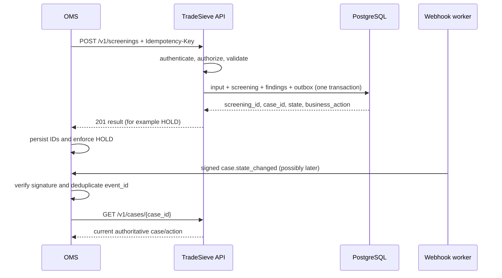

# Integration design

**Status:** Phase 1 integration contract baseline.

## Integration principle

The caller asks TradeSieve about a named proposed business action. TradeSieve returns a decision-support state and an operational action. The caller enforces that action and retains TradeSieve IDs; it does not reinterpret match scores or duplicate rule logic.

## Supported Phase 1 patterns

| Pattern | Use | Contract |
| --- | --- | --- |
| Synchronous gate | Quote/order/booking/shipment/payment cannot proceed without an immediate control result | REST `POST /v1/screenings` |
| State re-read | Caller needs authoritative current case/action after notification | REST `GET /v1/cases/{case_id}` |
| Asynchronous notification | Evidence/review/source change alters a prior case | Signed webhook event |
| Operator/batch | Analyst submits files or diagnostic batches | CLI over REST |
| Agent-assisted | Authorized agent screens/reads/explains/requests review | MCP over the same application service |

## Implemented demo CRM seam

[TS-505](https://github.com/fyaic/TradeSieve/issues/37) now includes a demo-only browser workspace at `/demo/crm`. It accepts only five repository-owned synthetic fixture IDs, converts each fixed CRM record into the canonical `ScreeningRequest`, runs the strict intake decoder and returns a precomputed canonical `ScreeningResult`. The purpose is to make the original CRM interception requirement visible before the production screening path exists.

The seam preserves the intended ownership split:

- the demo CRM owns customers, quotes, routes, amounts and document-status display;
- TradeSieve contracts own the screening request/result shape, state, action, findings, evidence requirements and opaque IDs;
- the browser never evaluates sanctions, goods or route rules;
- demo routes are registered only in explicit demo mode, accept no arbitrary business input and stay outside the formal OpenAPI inventory;
- [TS-303](https://github.com/fyaic/TradeSieve/issues/22), [TS-401](https://github.com/fyaic/TradeSieve/issues/23) and [TS-501](https://github.com/fyaic/TradeSieve/issues/24) replace the precomputed fixture path with governed controls, durable cases and the formal REST adapter.

See [the demo guide](../getting-started/demo-crm.md) for scenarios, startup and limitations.

## Synchronous gate sequence

### Caller persistence

Store only what the business workflow needs:

- `screening_id`, `case_id`, `request_correlation_id`;
- current `case_state`, `business_action`, short reason, `decision_expires_at`;
- last accepted `event_id`/event time;
- link to the authorized TradeSieve case view.

Do not copy raw sanctions records, similarity features, reviewer notes, or evidence documents into CRM unless an approved requirement exists.

## HTTP semantics

- `201 Created`: a new screening result was committed. It may be a hold/escalation.
- `200 OK`: an idempotent replay or successful read. It never means clearance.
- `202 Accepted`: bounded asynchronous work was queued and the returned business action remains `HOLD` until completion.
- `400/422`: invalid syntax/schema/field semantics; caller must correct input.
- `401/403`: authentication/authorization failure; caller holds and escalates integration access.
- `409`: idempotency conflict, forbidden state transition, or version conflict.
- `424/503`: required dependency/source coverage unavailable; caller follows fail-closed policy.
- `429`: rate limit; retry using `Retry-After`, with business action held.

Every error returns a stable `code`, `message`, `correlation_id`, `retryable`, and safe field/details object.

## Idempotency

- Required for screening submission, evidence submission, review request, decision, and webhook acknowledgement if added.
- Scope: tenant + authenticated client + operation + idempotency key.
- Persist canonical request hash and response/result reference.
- Same key/same hash returns the original result; same key/different hash returns `IDEMPOTENCY_CONFLICT`.
- Retention must cover the maximum caller retry/reconciliation window.

## Webhook envelope

The [generated case-state event](../../examples/events/case.state-changed.json) is the
canonical executable envelope. `event_type` supports top-level routing and must match
the nested `data.kind` discriminator; model validation rejects a mismatch. The payload
contains only subject references, state/action, and expiry—not findings, evidence, or
PII. Generated examples also cover
[`screening.completed`](../../examples/events/screening.completed.json) and
[`human_decision.recorded`](../../examples/events/human-decision.recorded.json).

Delivery requirements:

- HTTPS and per-endpoint secret/public-key configuration;
- timestamp plus body signature, replay window, and secret rotation;
- exponential retry with bounded attempts and dead-letter/operator visibility;
- at-least-once delivery, consumer deduplication by `event_id`;
- payload contains references and minimum required state, not full evidence/PII;
- consumer re-reads the case before an irreversible release.

## Versioning

- HTTP major version in path (`/v1`).
- OpenAPI/JSON Schema version is independent from legal source/rule/matcher/model versions.
- Additive optional fields are backward-compatible; enum additions require tolerant consumers or a minor contract policy.
- Removing/renaming/changing meaning requires a new major version and migration window.
- Request/response include `schema_version`; results include `version_set`.
- Webhook `event_version` is versioned per event type.

## CLI behavior

The CLI is a remote service client by default:

- reads JSON from `--input` or stdin;
- authenticates with a configured credential provider/token;
- supports `--json`, `--no-input`, `--quiet`, timeout, correlation, and idempotency options;
- renders traffic light plus text, priority, state, business action, case ID, and required evidence for humans;
- returns transport/validation/auth/system exit codes, not legal-decision exit codes.

An embedded/demo mode may be implemented only for tests and must use the same application/domain modules and explicit fixture versions.

## MCP behavior

Phase 1 tool set:

- `screen_party`, `screen_goods`, `screen_transaction`;
- `get_screening`, `get_screening_case`, `list_case_findings`, `list_required_evidence`;
- `get_source_snapshot`, `explain_rule_evaluation`;
- `submit_case_evidence`, `request_human_review`, `place_business_hold` under narrow scopes and confirmation.

The remote server uses MCP Streamable HTTP behind the same identity boundary. An optional stdio launcher can connect a local MCP client to the configured REST service; it does not bypass service authorization.

MCP schemas and results are tested against the canonical contract. Human-clearance mutation is absent from the general tool inventory.

## CRM/OMS mapping workshop

For each real integration, record:

1. triggering business event and proposed action;
2. source system/object/version and unique external ID;
3. available party/goods/route/document/payment fields and data owners;
4. maximum synchronous latency and retry behavior;
5. exact place where `HOLD`, `REQUEST_EVIDENCE`, `ESCALATE`, or effective human release is enforced;
6. user-facing short reason, case link, and evidence-request workflow;
7. webhook endpoint, authentication, deduplication, reconciliation, and outage runbook;
8. what happens when TradeSieve/source/identity is unavailable—never implicit allow at critical gates.
