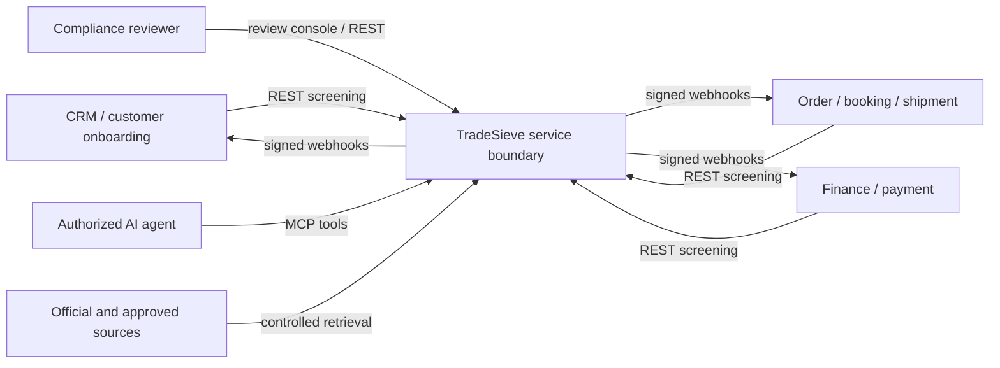
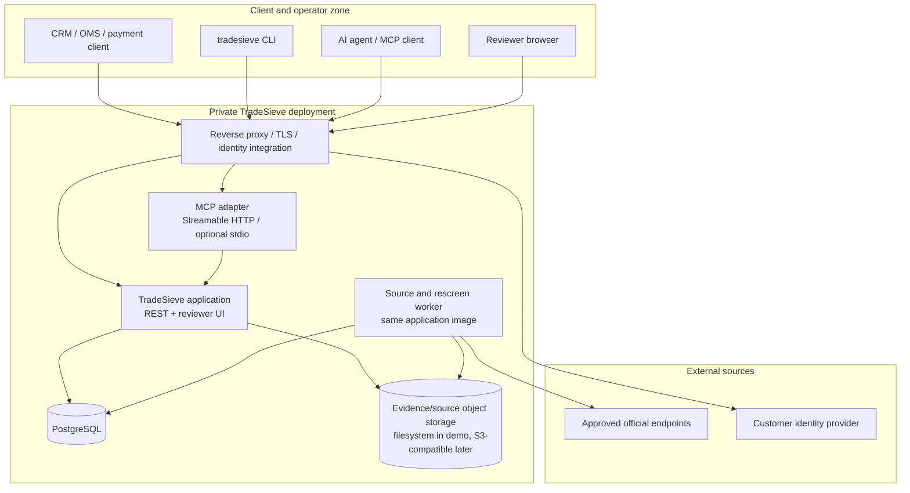
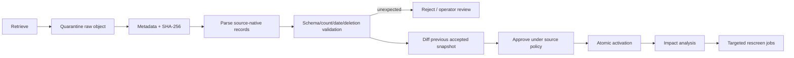

# Phase 1 service architecture

**Status:** Proposed implementation baseline
**Decision shape:** independently deployable modular service, not microservices.

## Architectural objective

Deliver the smallest architecture that can prove one complete compliance-control loop:

> ingest versioned evidence → accept a proposed business action → evaluate completeness/matches/rules → create a hold and case → obtain human disposition → notify the calling system → replay the decision.

The architecture optimizes for evidence consistency, safe integration, and learning speed. It does not optimize prematurely for organizational scale.

## System context



Business systems remain the systems of record for their objects and actions. TradeSieve owns the evidence, screening, case, decision, and provenance records required to control those actions.

## Deployment view



### Phase 1 runtime units

| Unit | Phase 1 responsibility | Scale path |
| --- | --- | --- |
| Application image | REST, reviewer pages, application/domain services | Replicate stateless HTTP workers after idempotency and outbox tests |
| MCP adapter | Typed tools mapped to application commands/queries | Deploy separately only when identity, scaling, or exposure differs |
| Worker command | Source retrieval/validation, jobs, rescreening, webhook delivery | Run multiple workers using database job leasing |
| PostgreSQL | Transactional facts, cases, audit events, source manifests, jobs/outbox | Managed PostgreSQL/HA after production design |
| Object store adapter | Immutable raw snapshots and evidence blobs | Local volume for demo; private S3-compatible storage for deployment |

The same image and codebase can run different commands. This preserves one contract while allowing process isolation where operationally useful.

## Internal modular architecture

```text
adapters (HTTP, CLI client, MCP, reviewer UI, source connectors, persistence)
                              │
application (commands, queries, authorization, idempotency, unit of work)
                              │
domain (entities, value objects, state machine, deterministic policies)
                              │
ports (repositories, source/matcher/policy/object-store/event interfaces)
```

Dependencies point inward. Domain/application modules do not import FastAPI, MCP, database ORM, source-specific parsers, or vendor matchers.

| Module | Owns | Does not own |
| --- | --- | --- |
| Intake | Canonical validation, external references, input snapshot | Legal conclusions |
| Source registry | Source metadata, snapshot lifecycle, activation | Matcher thresholds |
| Normalization | Canonical/source-native assertions and lineage | Human decisions |
| Matching | Candidate generation and evidence features | Case state or clearance |
| Policy evaluation | Versioned deterministic rule results | Missing-fact invention |
| Screening | Orchestration and reproducible result assembly | Interface-specific schemas |
| Cases | Findings, evidence, holds, state transitions, expiry | Business master data |
| Audit | Append-only material events and export | Mutable operational logging |
| Integrations | Idempotency, outbox, webhook delivery | Reimplementation of rules |
| Identity/authorization | Actor, tenant/scope/role decisions | Identity credential issuance |

## Command and query flow

1. Adapter authenticates the caller and validates transport-level limits.
2. Application service authorizes a named command against actor, tenant, action, and object scope.
3. Idempotency service resolves or reserves `(tenant, caller, operation, key)` and hashes the canonical request.
4. Intake stores an immutable input snapshot.
5. Screening loads an explicit active version set, runs deterministic controls, invokes matcher ports, and records model suggestions separately if enabled.
6. Case module materializes structured findings and derives the conservative state/business action.
7. One database transaction stores result, case/finding events, audit event, and outbox messages.
8. Adapter returns the stable result; workers deliver webhook/rescreen tasks from the outbox.

## State model

```mermaid
stateDiagram-v2
    [*] --> INCOMPLETE: material input missing
    [*] --> REVIEW_REQUIRED: open P1 / unresolved candidate
    [*] --> ESCALATE: open P0

    INCOMPLETE --> REVIEW_REQUIRED: evidence submitted
    REVIEW_REQUIRED --> ESCALATE: P0 identified
    ESCALATE --> REVIEW_REQUIRED: P0 resolved; P1 remains
    ESCALATE --> HUMAN_BLOCKED: authorized final block
    REVIEW_REQUIRED --> HUMAN_BLOCKED: business action declined
    REVIEW_REQUIRED --> GREEN_CANDIDATE: all P0/P1 resolved
    GREEN_CANDIDATE --> HUMAN_CLEARED: authorized human decision

    HUMAN_CLEARED --> REVIEW_REQUIRED: relevant change / expiry
    GREEN_CANDIDATE --> REVIEW_REQUIRED: relevant change
    INCOMPLETE --> ESCALATE: P0 identified
    INCOMPLETE --> CLOSED_NO_ACTION: proposal withdrawn
    REVIEW_REQUIRED --> CLOSED_NO_ACTION: proposal withdrawn
    ESCALATE --> CLOSED_NO_ACTION: proposal withdrawn

    note right of GREEN_CANDIDATE
      Automation-only condition.
      It is not a release state.
    end note
```



`GREEN_CANDIDATE` may appear in an assessment but is not a persisted business-release decision. Only a human decision event creates `HUMAN_CLEARED` for an explicit action/scope/expiry.

`HUMAN_BLOCKED` and `CLOSED_NO_ACTION` are also authorized human/business dispositions. They record that the named proposal will not proceed; they are not generated autonomously from a match score.

## Source pipeline



Parsing and activation are separate. A connector can successfully retrieve and parse a source while activation remains blocked by governance or data-quality checks.

## Data consistency pattern

- PostgreSQL is the transactional source of truth for metadata, domain records, jobs, and audit/outbox events.
- Raw documents and source objects are immutable blobs addressed by hash; the database stores hash, size, media type, and controlled location.
- Screening and its initial findings are committed atomically.
- Webhooks and rescreen requests use a transactional outbox, avoiding a database-committed result with a lost notification.
- Job leasing uses bounded retries, backoff, dead-letter state, and idempotent handlers. Phase 1 does not require a separate message broker.
- Timestamps use UTC; source-reported effective time, retrieval time, observation-valid time, and system-recorded time remain distinct.

## Search and matching

Phase 1 begins with deterministic normalization, exact identifiers, and a matcher adapter. PostgreSQL `pg_trgm` can support an explainable baseline and candidate retrieval; yente/Watchman/Splink remain benchmark candidates rather than embedded legal authorities.

The matcher returns candidate evidence:

- candidate entity/snapshot record;
- matched/conflicting fields;
- normalization/transliteration path;
- component scores and configured threshold/version;
- coverage warnings and uncertainty.

The screening/case layer—not the matcher—decides whether a candidate creates a finding and required action.

## Evolution triggers

Split a module into a separate service only when measured evidence shows one of these conditions:

- source ingestion requires a materially different trust/network boundary;
- matching needs independent hardware/scaling or licensed data isolation;
- webhook/job throughput creates unacceptable contention;
- separate teams require independent release cadence with stable contracts;
- a failure domain cannot meet production availability/security objectives inside the modular deployment.

Before such a trigger, microservices would add distributed transactions, version drift, tracing, deployment, and operational burden without improving the Phase 1 outcome.
