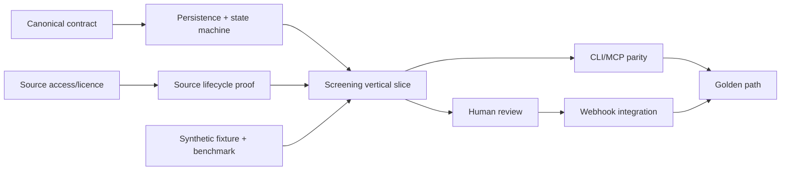

# Phase 1 delivery plan

**Milestone:** Phase 1 — Service MVP
**Baseline dates:** 2026-08-10 to 2026-09-18
**Cadence:** three two-week sprints
**Capacity warning:** scope and dates must be recalibrated when named team capacity, real-system access, and source/licence access are known.

## Phase goal

Deliver a runnable, private, evidence-oriented service MVP that proves one transaction from intake through conservative screening, case/human review, downstream notification, source-change rescreening, and replay—with equivalent REST, CLI, and MCP results.

## Sprint plan

### Sprint 1 — Walking skeleton and contract (2026-08-10 to 2026-08-21)

Sprint goal: a clean checkout starts an authenticated, observable service with PostgreSQL, migrations, canonical schemas, audit/idempotency/outbox foundations, and a synthetic screening request that produces a persisted conservative case.

Expected outcomes:

- implementation project/container/CI skeleton;
- reviewed OpenAPI/domain schemas and synthetic golden request;
- identity/tenant/role context and deny-by-default authorization foundation;
- input/screening/case/finding persistence and state-machine unit tests;
- deterministic completeness/exact-identifier checks;
- source registry/synthetic immutable snapshot foundation;
- REST create/read vertical slice and interactive docs.

Sprint review: run Docker Compose from a clean checkout, submit the golden REST request twice with the same key, and show one persisted case, audit stream, outbox record, and `HOLD` result.

### Sprint 2 — Evidence, sources, matching, and human workflow (2026-08-24 to 2026-09-04)

Sprint goal: the service can explain candidate and missing-evidence findings, operate source snapshots/deltas, and complete an authorized human decision workflow without any automated clearance path.

Expected outcomes:

- EU/OFAC source lifecycle proof subject to approved access/licence;
- multilingual synthetic fixture set and benchmarked matcher adapter;
- goods/route/end-use/payment completeness and consistency rules for the golden case;
- evidence submission, finding resolution, review request, scoped human decision, expiry/invalidation;
- minimal reviewer queue/case pages;
- source delta impact analysis and rescreen worker;
- authorization, tenant, prompt-injection, append-only, and negative clearance tests.

Sprint review: resolve the golden case as an authorized reviewer, show service/agent denial, activate a relevant source delta, and show the decision return to review.

### Sprint 3 — Interfaces, integration, and releasable MVP (2026-09-07 to 2026-09-18)

Sprint goal: a new evaluator can use and integrate the service through documented REST, CLI, MCP, webhook, and reviewer flows from a released package.

Expected outcomes:

- CLI human/JSON commands and parity tests;
- MCP Streamable HTTP tools, optional stdio launcher, auth and prompt-injection controls;
- signed/retried/deduplicated webhooks and sample CRM/OMS gate consumer;
- source freshness/readiness and operational diagnostics;
- redacted evidence/audit export, backup/restore, observability, SBOM/security checks;
- performance/matcher/reviewer evidence and known-limitations report;
- install, quickstart, integration, operations, and troubleshooting docs;
- versioned release candidate and complete golden-path automation.

Sprint review: an evaluator follows the target experience without maintainer intervention and completes all Phase 1 acceptance gates.

## Critical path

Source access, real-system field inventory, reviewer authority, and fixture acceptance are the highest schedule risks. The golden path must still work in clearly labelled synthetic demo mode if official-source access is delayed; such delay remains a production-readiness gap, not a hidden stub.

## Decision gates

| Gate | Required by | Decision/evidence |
| --- | --- | --- |
| D1 Product/legal scope | Sprint 1 midpoint | Initial legal nexus/regime/action/source scope and named compliance owner |
| D2 Contract baseline | Sprint 1 end | Canonical request/result/case/event schemas approved |
| D3 Stack/ADR acceptance | Sprint 1 end | Clean skeleton, MCP compatibility, persistence/matcher spike evidence |
| D4 Matching/source activation | Sprint 2 | Fixture metrics, source licence/quality, threshold/version/rollback approval |
| D5 Human workflow | Sprint 2 end | Role/four-eyes/expiry/invalidation negative tests and compliance acceptance |
| D6 MVP release | Sprint 3 end | Golden path, security/backup/benchmark, docs, limitations and multi-owner sign-off |

## Release policy

- Each sprint should leave `main` deployable in demo mode.
- Release candidate is cut only after the Phase 1 golden path passes from a clean environment.
- Version `0.1.0` denotes an MVP, not production legal coverage.
- Release notes begin with known limitations, supported demo/source scope, security/data assumptions, and upgrade/rollback instructions.
- Production deployment requires a separate gate and may not be inferred from a GitHub release.

## Owners needed

| Responsibility | Owner needed before |
| --- | --- |
| Product/backlog and acceptance | Sprint 1 planning |
| Legal/compliance scope and human decision policy | D1 |
| Engineering architecture and release | Sprint 1 planning |
| Security/privacy/identity/deployment | Sprint 1 midpoint |
| Source/data operations and licences | Source connector implementation |
| CRM/OMS/payment integration | Sprint 2 refinement |
| Reviewer operations and usability | Reviewer-flow implementation |
