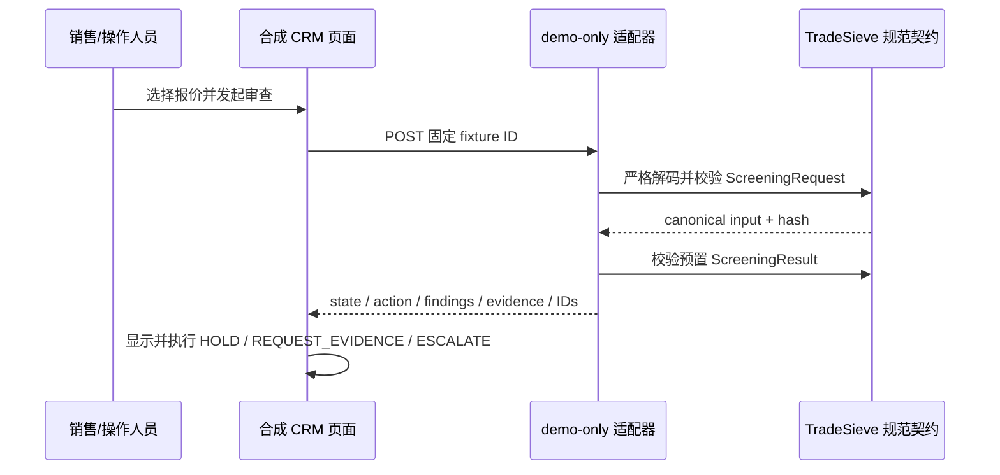

# 合成国际物流 CRM 演示

**状态：** Phase 1 demo-only 集成样例。  
**数据：** 全部为仓库内置合成数据，不得替换为真实客户、货物、付款或身份数据。  
**对应 story：** [TS-505 / #37](https://github.com/fyaic/TradeSieve/issues/37)

## 它演示什么

这个页面模拟一家中国国际货运代理公司的询报价工作台。销售可以选择一条报价，在“报价放行”之前发起 TradeSieve 审查，并观察 CRM 如何处理：

- 红灯 P0：暂停报价并升级合规复核；
- 黄灯 P1：保持拦截，并显示具体补件要求；
- 绿灯候选：没有开放 P0/P1，但仍等待授权人工确认，不能由系统自动放行；
- 外部引用：CRM 只保留 `screening_id`、`case_id`、结果指纹、状态和业务动作；
- 解耦边界：货物、主体、路线和付款字段通过规范契约映射，规则和审查证据不写进 CRM。

页面包含 5 条固定场景：

| 场景 | 主要业务事实 | 预置合成结果 |
| --- | --- | --- |
| 上海到莫斯科的工业控制设备 | 合成强标识符命中、最终用户缺失、技术参数不完整 | 红灯 P0，暂停并升级 |
| 深圳到法兰克福的锂电池模组 | MSDS、UN38.3 和运输鉴定资料不完整 | 黄灯 P1，暂停并补件 |
| 宁波经杰贝阿里转售的伺服驱动器 | 最终用户、最终使用国和转售路径未知 | 黄灯 P1，保持拦截 |
| 青岛到鹿特丹的一般工业维护品 | 合成确定性控制没有开放 P0/P1 | 绿灯候选，等待人工确认 |
| 上海到伊斯坦布尔的精密传感器 | 技术参数和最终用途证据不足 | 黄灯 P1，暂停并补件 |

名称、地址、登记号、金额、时间、路线和单证均为合成 fixture。它们的结构尽量贴近中国货代销售、报价和订舱流程，但不对应任何真实企业或个人。

## 启动和使用

从仓库根目录启动参考栈：

```bash
cp .env.example .env
docker compose up -d --build --wait
```

打开：

```text
http://127.0.0.1:8080/demo/crm
```

1. 在左侧选择一条询报价；
2. 查看 CRM 已有的运输、货物、金额和单证字段；
3. 点击“发起合规审查”；
4. 查看信号灯、P0/P1、业务动作、风险事项、补件要求和不透明案件引用；
5. 切换场景，比较 CRM 对红灯、黄灯和绿灯候选的不同处理。

停止并删除 demo 数据：

```bash
docker compose down --volumes --remove-orphans
```

## 当前实际调用链



这个 story 故意只接受仓库内固定的 `record_id`，不接收任意客户输入。服务会对映射后的 `ScreeningRequest` 执行真实的规范解码、上下文绑定和输入指纹校验；`ScreeningResult` 也使用正式 Pydantic 规范模型校验。但是 finding 和处置是预置合成 fixture，不是实时名单、物项或法律规则执行结果。

## 与正式 REST 集成的替换缝

当前浏览器页面调用：

```text
GET  /demo/api/crm/records
GET  /demo/api/crm/records/{record_id}
POST /demo/api/crm/records/{record_id}/screen
```

这些路由：

- 只在 `TRADESIEVE_MODE=demo` 时注册；
- 不出现在公开 OpenAPI；
- 不持久化案件，也不处理任意输入；
- 不改变当前正式 HTTP 操作清单。

[TS-501 / #24](https://github.com/fyaic/TradeSieve/issues/24) 完成后，CRM 网关应把固定 demo 调用替换为 `POST /v1/screenings`，并继续以相同方式执行返回的 `business_action`。生产集成还要补齐：

1. 经验证的服务身份与对象级授权；
2. `Idempotency-Key`、correlation ID、超时与重试；
3. 对 401/403/409/424/429/503 的失败关闭处理；
4. 持久化 `screening_id`、`case_id` 和最小状态投影；
5. 签名 webhook 的验签、去重和状态回读；
6. 只有生效且未过期的授权人工决定才能释放指定业务动作。

CRM 不应复制 TradeSieve 内部的制裁记录、规则表达式、相似度特征、证据正文或复核笔记。

## 明确限制

- 它不是实时制裁名单筛查、两用物项归类或敏感货物判断服务；
- 它不代表欧盟、美国、中国或任何其他法域的法律结论；
- 它不证明任何主体、货物、路线、付款或交易可以放行；
- 它没有案件持久化、证据提交、人工决定、webhook、CLI 或 MCP 闭环；
- 红灯和黄灯用于演示拦截效果，绿灯候选仍不是人工放行；
- 正式确定性控制、案件状态和 REST 路由分别由 [TS-303 / #22](https://github.com/fyaic/TradeSieve/issues/22)、[TS-401 / #23](https://github.com/fyaic/TradeSieve/issues/23) 和 [TS-501 / #24](https://github.com/fyaic/TradeSieve/issues/24) 交付。

不要把页面截图、响应或 fixture 当作客户尽调、银行沟通、许可证申请或法律意见。
