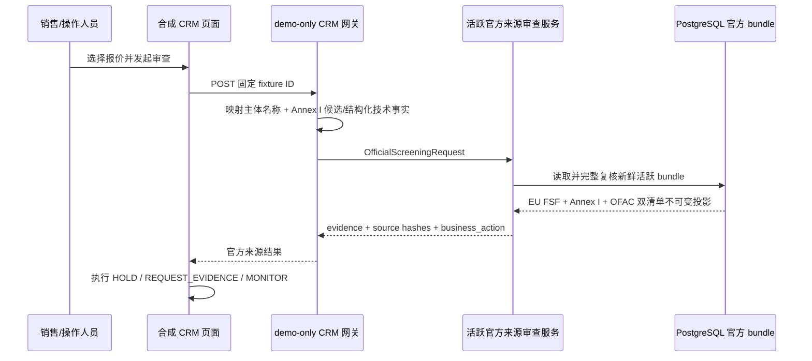

# 合成国际物流 CRM 演示

**状态：** Phase 1 demo-only 交易界面 + 真实活跃 EU/OFAC 官方来源技术预览。

**数据：** 交易、路线、金额和单证均为仓库内置合成数据；首条记录使用一个公开 EU FSF 企业别名作为可重复验收事实，不代表真实客户关系。

**对应 story：** [TS-505 / #37](https://github.com/fyaic/TradeSieve/issues/37)

## 它演示什么

这个页面模拟一家中国国际货运代理公司的询报价工作台。销售可以选择一条报价，在“报价放行”之前发起 TradeSieve 审查。浏览器不执行规则；demo 后端把固定交易映射成官方审查请求，并调用 PostgreSQL 中的新鲜活跃四源 bundle：

- EU FSF 名称候选、EU reference 和原生 XML 定位；
- OFAC SDN/Consolidated 的独立版本、program、名称/强标识候选和原生定位；
- Annex I 控制号状态、CELEX、条目定位和缺失事实；
- 同一个 source bundle 下的 FSF/Annex I/OFAC SDN/OFAC Consolidated snapshot ID 和内容哈希；
- 首批 `3A001` 技术断言的规则版本、条目哈希、单位化参数比较和证据引用；
- `HOLD` / `REQUEST_EVIDENCE` / `MONITOR`；任何结果都不自动放行；
- 来源未激活、陈旧、损坏或数据库不可用时，CRM 保持拦截。

页面包含 5 条固定场景：

| 场景 | 主要业务事实 | 当前真实来源审查表现 |
| --- | --- | --- |
| 上海到莫斯科的工业控制设备 | 公开 FSF 企业别名验收样本；Annex I 候选 `3A001`；技术规格缺失 | 名称候选 + 控制项存在，`RED/HOLD`；要求合格归类复核和技术规格 |
| 深圳到法兰克福的高能量密度二次电芯 | 合成主体；显式合格 `3A001` 候选；制造商合成规格给出非电池包、二次电芯、20°C 下 380 Wh/kg | 同一活跃官方条目驱动 `3A001.e.1` 严格阈值比较，返回 `MATCHED` + `RED/HOLD`；不是自动归类或放行 |
| 宁波经杰贝阿里转售的伺服驱动器 | 合成主体；最终用户和 Annex I 归类未提供 | 当前只反馈名单/归类缺口；路线和转售控制尚未接入本引擎 |
| 青岛到鹿特丹的一般工业维护品 | 合成主体；技术资料存在但没有 Annex I 归类 | 仍要求合格归类，不把一般货描或 HS 当作自动绿灯 |
| 上海到伊斯坦布尔的精密传感器 | 合成主体；技术参数和正式归类缺失 | 请求补充归类和技术事实；最终用途规则仍待后续接入 |

除明确标出的公开名单测试别名外，名称、地址、登记号、金额、时间、路线和单证均为合成 fixture。结构贴近中国货代销售、报价和订舱流程，但不对应真实业务。

## 启动和使用

从仓库根目录启动参考栈：

```bash
cp .env.example .env
docker compose up -d --build --wait
```

首次打开页面前刷新并激活官方来源：

```bash
docker compose run --rm --no-deps app \
  python -m tradesieve.manage refresh-official-sources
```

打开：

```text
http://127.0.0.1:8080/demo/crm
```

1. 在左侧选择一条询报价；
2. 查看 CRM 已有的运输、货物、金额和单证字段；
3. 点击“发起合规审查”；
4. 查看信号灯、业务动作、官方名单/Annex I 证据、缺失事实和来源哈希；
5. 停止数据库或在 48 小时后不刷新，验证 CRM 失败关闭而不是隐式通过。

停止并删除 demo 数据：

```bash
docker compose down --volumes --remove-orphans
```

## 当前实际调用链



这个路由故意只接受仓库内固定的 `record_id`，不接收任意客户输入。真实名单和控制项证据来自最近一次已验证激活，而不是预置响应。旧的 `/screen` 预置 fixture 路由仍保留给规范模型回归测试，但页面不再调用它。

## 与正式 REST 集成的替换缝

当前浏览器页面调用：

```text
GET  /demo/api/crm/records
GET  /demo/api/crm/records/{record_id}
POST /demo/api/crm/records/{record_id}/screen
POST /demo/api/crm/records/{record_id}/screen-official
```

这些路由：

- 只在 `TRADESIEVE_MODE=demo` 时注册；
- 不出现在公开 OpenAPI；
- `/screen-official` 不持久化案件，但读取真实活跃官方来源；
- 浏览器不持有 `/v1/official-screenings` 的 Bearer token。

外部 CRM/OMS 可用认证技术预览 `POST /v1/official-screenings` 验证同一应用服务；完整生产集成仍应收敛到 [TS-501 / #24](https://github.com/fyaic/TradeSieve/issues/24) 的 `POST /v1/screenings` 案件/幂等契约，并补齐：

1. 经验证的服务身份与对象级授权；
2. `Idempotency-Key`、correlation ID、超时与重试；
3. 对 401/403/409/424/429/503 的失败关闭处理；
4. 持久化 `screening_id`、`case_id` 和最小状态投影；
5. 签名 webhook 的验签、去重和状态回读；
6. 只有生效且未过期的授权人工决定才能释放指定业务动作。

CRM 不应复制 TradeSieve 内部的制裁记录、规则表达式、相似度特征、证据正文或复核笔记。

## 明确限制

- 它会读取最近激活的真实 EU/OFAC 官方来源，但不是“每次点击都联网”；来源最长允许 48 小时，刷新应由受控运维任务执行；
- 名称仅做 Unicode 规范化后的官方别名精确候选，不含模糊、音译、词序变体和所有权/控制；
- OFAC 名单候选不等于 50 Percent Rule、program 法律效果或交易禁止结论；
- 两用物项核验显式 Annex I 控制号；对 `3A001.a.5.a`、`.a.14`、`.e.1` 的有限产品族执行来源绑定数字阈值，其他分支明确 `UNSUPPORTED/INCOMPLETE`；不会从 HS、货描或模型自动作正式技术归类；
- 俄罗斯 `833/2014` 货物附件、路线、最终用途、catch-all、金融/服务限制尚未接入；
- 它不代表欧盟、美国、中国或任何其他法域的法律结论；
- 它不证明任何主体、货物、路线、付款或交易可以放行；
- 它没有案件持久化、证据提交、人工决定、webhook 或 MCP 闭环；当前官方来源 CLI 已可用，但不是完整案件客户端；
- 红灯和黄灯用于演示拦截效果，绿灯候选仍不是人工放行；
- 完整确定性控制、案件状态和生产 REST 路由分别由 [TS-303 / #22](https://github.com/fyaic/TradeSieve/issues/22)、[TS-401 / #23](https://github.com/fyaic/TradeSieve/issues/23) 和 [TS-501 / #24](https://github.com/fyaic/TradeSieve/issues/24) 继续交付。

不要把页面截图、响应或 fixture 当作客户尽调、银行沟通、许可证申请或法律意见。
