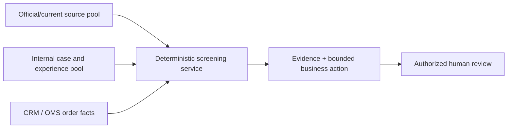

# Prototype release boundary

**Release target:** `0.1.0a4`
**Evidence date:** 2026-08-11  
**Status:** demonstrable engineering prototype; not a production legal-clearance service.

## Product direction

The core product constraint is that TradeSieve must not merely collect another spreadsheet of names. Its value is keeping selected source evidence current, connecting it to everyday CRM/OMS decisions, and returning a bounded action that the business system can enforce. The project therefore delivers an independent control service and keeps regulatory facts, internal experience and business workflow responsibilities separate.

This prototype is intentionally useful without pretending that the project team can replace qualified sanctions, export-control or customs professionals. It demonstrates repeatable retrieval, provenance, matching, candidate detection, conservative business actions and failure behavior. It does not approve legal interpretations.

## What this release demonstrates

| Capability | Implemented prototype behavior | Boundary |
| --- | --- | --- |
| Current sanctions sources | Retrieve, validate and atomically activate EU FSF, OFAC SDN and OFAC Consolidated with source hashes and timestamps | Exact strong identifiers and exact normalized aliases only; no fuzzy/transliteration or ownership propagation |
| EU dual-use source | Retrieve and persist the pinned current Annex I publication; evaluate an explicitly supplied control-code candidate | No HS-to-control-code inference and no definitive classification |
| Technical assertions | Compare typed, evidenced facts for a small, source-hash-bound subset of `3A001` | Unsupported branches remain incomplete; a non-match is not clearance |
| Sensitive-goods candidate | Compare an explicitly supplied HS candidate with the 50-item BIS Common High Priority List | A hit means enhanced due diligence; it is not an export prohibition or legal control classification |
| CRM interaction | Five fixed, China international-logistics-style scenarios call the same active-source service used by CLI and REST | Transactions are synthetic; the page is a demonstration fixture, not a production CRM |
| Business response | Return `HOLD`, `REQUEST_EVIDENCE` or `MONITOR`; stale, missing or corrupt active sources fail closed | `GREEN_CANDIDATE` and HTTP 200 never mean legal permission |
| Distribution | Reproducible Python wheel/source archive, Docker Compose reference stack, REST/CLI and local stdio MCP examples, versioned contracts | Reference deployment lacks production identity, remote MCP OAuth, tenancy, HA and operational ownership |

## Two pools with different authority

- The **official/current source pool** stores regulator publications, immutable projections, content hashes, activation history and freshness. Its data can create screening evidence, but source membership alone does not implement every applicable legal effect.
- The **internal case and experience pool** is intended for attributed historic interactions, human findings, documents and decisions. The supplied workbook and internal interview notes belong here as research inputs. Internal experience never silently becomes an official list or an automatic clearance rule.
- The **CRM/OMS** remains the business system of record. It sends explicit parties, goods, route, end-use and payment facts and must enforce the returned hold or evidence request.

The current prototype has the official pool vertical slice and the underlying immutable intake/audit foundations. General workbook ingestion, experience search, case review and re-screening are not yet complete.

## Claims this release may and may not make

Safe claims:

- “The request produced an exact candidate in the named, versioned source.”
- “The supplied HS-6 candidate is present in the BIS CHPL tier shown.”
- “The supplied technical facts met or did not meet this bounded, source-bound assertion.”
- “The source bundle was fresh and internally consistent at the recorded time.”
- “The CRM should hold, request named evidence or monitor under the prototype policy.”

Forbidden claims:

- “The customer is sanctioned” based only on a name candidate.
- “The goods are controlled” based only on HS, CHPL or free-text description.
- “The transaction is legal, licensed, exempt or safe to release.”
- “No match” means no sanctions, ownership, export-control, route, end-use or bank risk.
- The prototype covers all applicable EU, US, Chinese, Russian or third-country controls.

## Handoff rule

This release can be used for demonstrations, architecture evaluation and synthetic integration testing. A real deployment still requires a named owner to approve jurisdiction and source scope, lawful data use, matching policy, evidence requirements, reviewer authority, refresh operations, security/privacy controls and the exact CRM actions that may be released. Until then, use synthetic or specifically approved pilot data and treat every unavailable or unresolved result as a hold.
